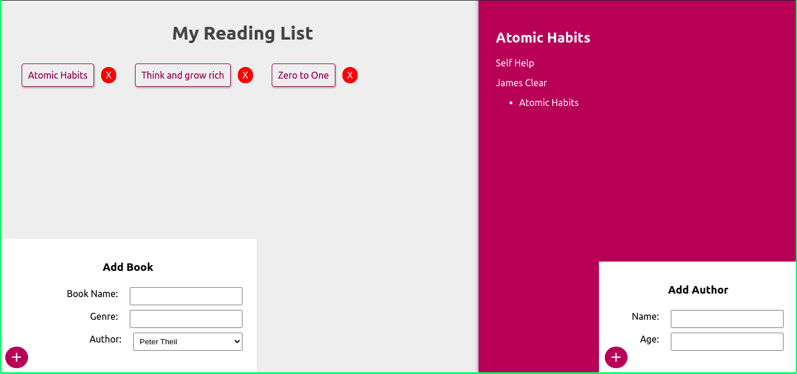

### GraphQL Basics

It is a GraphQL Project for getting Started with GraphQL using JS and React.

Uses Functional Approach to building for frontend.

## Installation Steps

# Server
Since this application uses MongoDB as its basic Database storage, do make a cluster at [Atlas](https://www.mongodb.com/cloud/atlas) for free to get started. Or Alternatively you can use it locally.
- Clone the repository
- Go inside folder  `server`
- run `npm install`
- create a file with name `.env`
- Alternatively can use [nodemon](https://www.npmjs.com/package/nodemon) for development purpose. If so run `npm install -g nodemon` and after that `nodemon app` from client root directory
- Or can also use `node app.js`

On Success run you will find console logs as
`Server Listening on Port 4000`
`Connected to Database`

# Client
This Application uses create-react-app boilerplate for React starter code. Implemented only on Functional Components and React Hooks. and Uses React Appolo Client for Interacting with GraphQL.
- Clone the repository
- Go inside folder `client`
- run `npm install`
- run `npm start`

On Success the frontend will be available on port 3000 of your localhost.  
